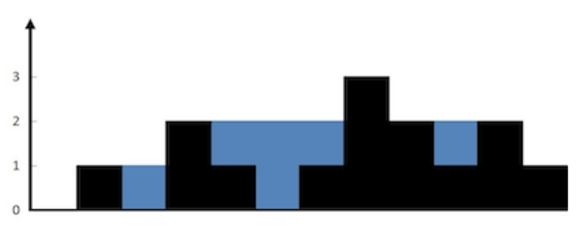

# Arrays and Sequences questions

## Question 1.1
Given a sorted array, remove the duplicates in place such that each element appear only once
and return the new length.
Do not allocate extra space for another array, you must do this in place with constant memory.
For example, Given input array A = [1,1,2],
Your function should return length = 2, and A is now [1,2].

## Question 1.2
Given an array of integers, find two numbers such that they add up to a specific target number.
The function twoSum should return indices of the two numbers such that they add up to the target, where
index1 must be less than index2. Please note that your returned answers (both index1 and index2) are not
zero-based. You may assume that each input would have exactly one solution.
Input: numbers={2, 7, 11, 15}, target=9
Output: index1=1, index2=2

## Question 1.3
Given n non-negative integers representing an elevation map where the width of each bar is 1, compute how much water it is able to trap after raining.
For example, Given [0,1,0,2,1,0,1,3,2,1,2,1], return 6.

## Question 1.4
The gray code is a binary numeral system where two successive values differ in only one bit.Given a non-negative integer n representing the total number of bits in the code, print the sequence of gray code. A gray code sequence must begin with 0.
For example, given n = 2, return [0,1,3,2]. Its gray code sequence is:
00 -0 
01 -1
11 -2
10 -3
Note:
• For a given n, a gray code sequence is not uniquely defined.
• For example, [0,2,3,1] is also a valid gray code sequence according to the above definition.

## Question 1.5
There are N children standing in a line. Each child is assigned a rating value.
You are giving candies to these children subjected to the following requirements:
• Each child must have at least one candy.
• Children with a higher rating get more candies than their neighbors.
What is the minimum candies you must give?

## Question 1.6 
Given a string, determine if it is a palindrome, considering only alphanumeric characters and ignoring
cases.
For example,
"A man, a plan, a canal: Panama" is a palindrome.
"race a car" is not a palindrome.
Note: Have you consider that the string might be empty? This is a good question to ask during an
interview.
For the purpose of this problem, we define empty string as valid palindrome.

## Question 1.7
Implement regular expression matching with support for '.' and '*'.
'.' Matches any single character. '*' Matches zero or more of the preceding element.
The matching should cover the entire input string (not partial).
The function prototype should be:
bool isMatch(const char *s, const char *p)
Some examples:
isMatch("aa","a") → false
isMatch("aa","aa") → true
isMatch("aaa","aa") → false
isMatch("aa", "a*") → true
isMatch("aa", ".*") → true
isMatch("ab", ".*") → true

## Question 1.8
Given a string containing just the characters '(', ')', '{', '}', '[' and ']', determine if the input string is valid.
The brackets must close in the correct order, "()" and "()[]" are all valid but "(]" and "([)]" are not.

